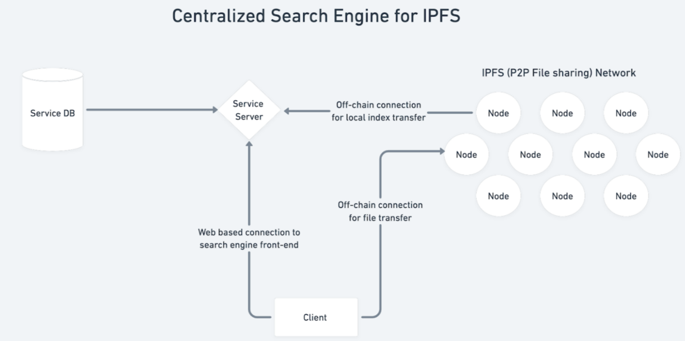

# Introduction

IPFS assigns a unique content identifier (CID) to each uploaded file, allowing users to retrieve the corresponding file accurately. However, IPFS lacks search functionality based on keywords or descriptive information, limiting its usability. To address this, the objective of this project is to build a centralized search engine on top of IPFS. This engine will create a global index by receiving local indexes from participating nodes, enabling users to search for IPFS-hosted files efficiently. Additionally, the project aims to implement synchronization strategies for maintaining an up-to-date global index and incorporate content moderation to identify and exclude illegal files. By providing a centralized search engine, users can easily locate and access relevant files stored on IPFS nodes.


# 1.Installation and Run

## 1.1FrontEnd - ReactJS

```bash
cd IPFS_Frontend
npm install
npm start
```

The server will listen on port 3000

## 1.2BackEnd - NodeJS

```bash
cd IPFS_Backend
npm install
nodemon
```

The server will listen on port 3001

## 1.3 IPFS

Open your IPFS system locally.

# 2.Solution

Using IPFS API to get the CID first, and then using that CID and IPFS API to get file content through IPFS network
Using Hooks in React to save the status of files

# 3.Feature Work

Synchronization
Optimizing the synchronization process of the local and global indexes to reduce the latency in response time of the system.

Content moderation
Developing a better content moderation strategy to identify and exclude illegal files more effectively.

Scalability
As the scale of data continues to grow, the proposed system may need to be scaled up to accommodate the increasing number of nodes and files in the IPFS network

# 4.Students Contributions

Junwei Li
Joaquin Uriarte
